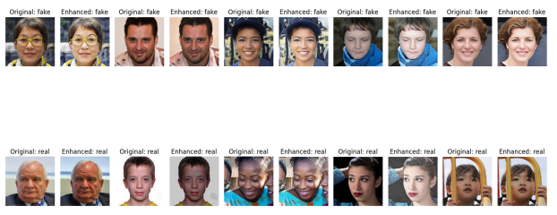
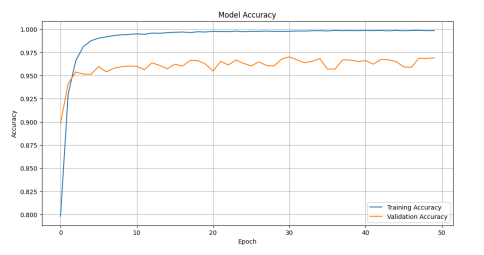
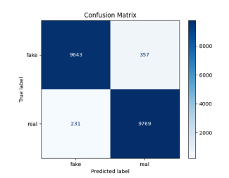

# Deepfake Detection: A Comparative Study of CNN and ResNet-50

This project explores the effectiveness of deep learning architectures in distinguishing real human faces from AI-generated (StyleGAN) fakes. It features a custom data enhancement pipeline and a comparative analysis of standard CNN vs. Residual Network (ResNet) performances.

## 🚀 Key Highlights
* [cite_start]**Dataset:** Utilized the xhlulu/140K Real and Fake Faces dataset (70K Real / 70K Fake)[cite: 261].
* [cite_start]**High Accuracy:** Achieved a peak validation accuracy of **98.42%** using a 50-epoch CNN model[cite: 350].
* [cite_start]**Architecture Analysis:** Compared custom CNN layers against ResNet-50 to evaluate feature extraction and gradient stability[cite: 298, 432].

## 🛠️ Data Preprocessing & Enhancement
To improve model generalization, I developed an **Enhanced Dataset** using:
1. [cite_start]**Sharpening Kernel Filters:** To magnify edge features and image boundaries[cite: 286].
2. [cite_start]**Histogram Equalization:** To improve image contrast and reduce lighting disparities[cite: 287].
3. [cite_start]**Haar-cascades:** For automated facial region extraction[cite: 289].

| Original Dataset | Enhanced Dataset |
| :---: | :---: |
|  |  |
*(Note: Ensure your filenames in the results folder match these paths)*

## 📊 Performance Results
[cite_start]The models were trained using **NVIDIA L4/T4 GPUs** on Google Colab[cite: 294].

### CNN (Original Dataset) - 50 Epochs
* [cite_start]**Validation Accuracy:** 98.42% [cite: 350]
* [cite_start]**F1-Score:** 0.98 [cite: 356]

## 📂 Repository Structure
* `/notebooks`: Cleaned Jupyter Notebooks for CNN and ResNet-50 training.
* `/results`: Accuracy/Loss curves and Confusion Matrices.
* `requirements.txt`: Environment dependencies.

## 💻 Tech Stack
* **Language:** Python
* **Frameworks:** TensorFlow, Keras
* **Libraries:** OpenCV, Matplotlib, Scikit-learn
